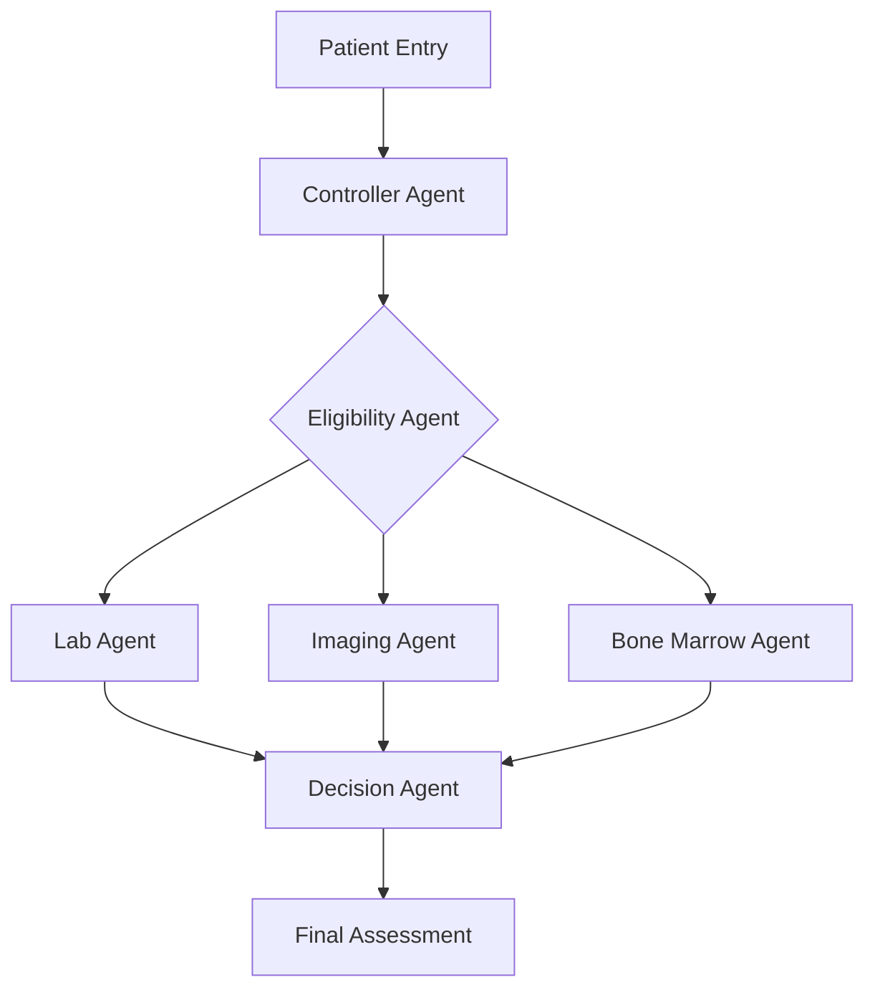
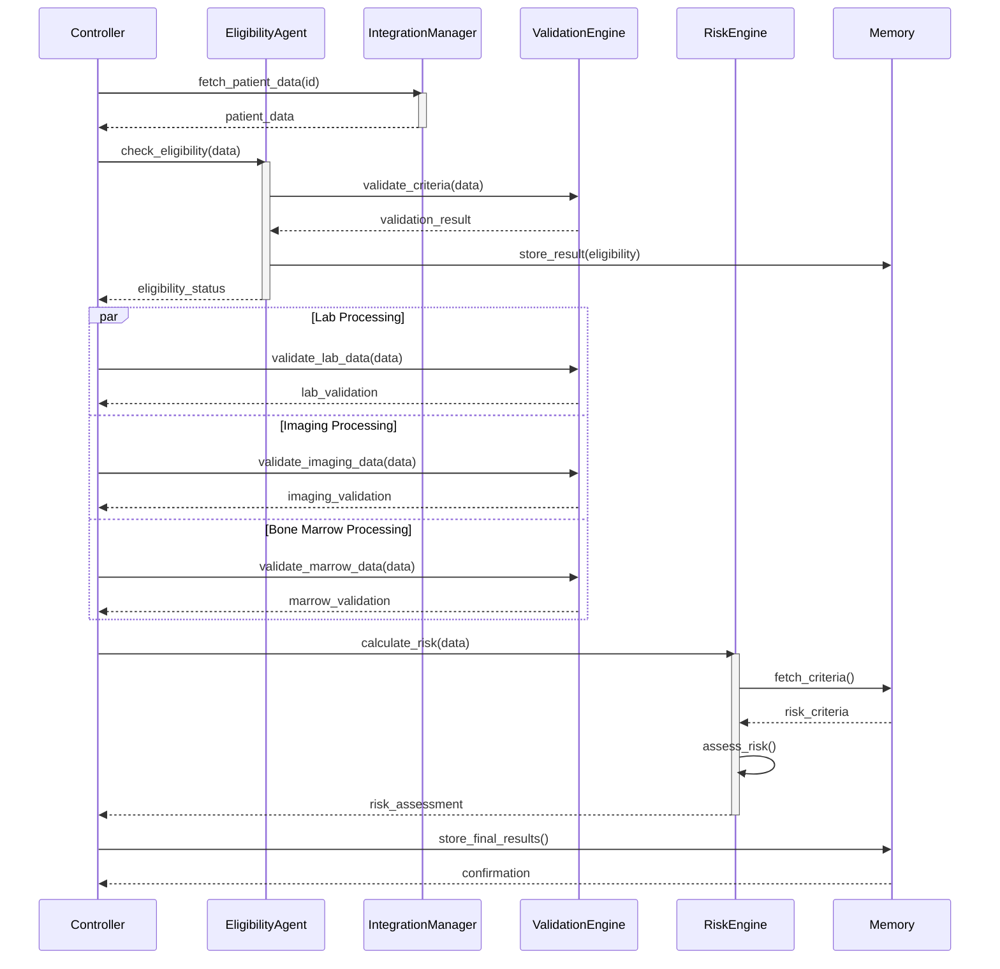

# PROMETHEUS: Phase 1 - Screening & Baseline System

## AI-Powered Clinical Trial Patient Screening System

### Table of Contents

- [Overview](#overview)
- [System Architecture](#system-architecture)
- [Agent Implementations](#agent-implementations)
- [Validation Rules](#validation-rules)
- [Risk Stratification](#risk-stratification)
- [Integration Points](#integration-points)
- [Development Guide](#development-guide)

## Overview

PROMETHEUS is an agent-based clinical trial screening system that automates and standardizes the patient screening process using specialized AI agents. The system handles data collection, validation, analysis, and decision-making for clinical trial eligibility assessment.

### Key Features

- Multi-agent architecture for specialized processing
- Real-time data validation and quality control
- Automated risk stratification
- Integration with hospital systems (EPIC, LIS, RIS)
- Comprehensive audit trail

## System Architecture

### Core Components

1. **Controller Layer**

   - Orchestrator Agent
   - Planning Agent
   - Decision Making Agent
2. **Specialized Agents**

   - Eligibility Assessment Agent
   - Bone Marrow Analysis Agent
   - Laboratory Data Agent
   - Imaging Analysis Agent
   - Performance Status Agent
   - Genetic Analysis Agent
3. **Memory Systems**

   - Working Memory
   - Long-term Memory
   - Knowledge Base

### Data Flow



## Agent Implementations

### 1. Controller Agent

```python
class ControllerAgent:
    def __init__(self, config: AgentConfig):
        self.llm = config.llm_model
        self.memory = WorkingMemory()
        self.agents = self._initialize_agents()
        self.state_manager = StateManager()

    def orchestrate_screening(self, patient_id: str):
        try:
            # Initialize screening process
            screening_context = self._create_context(patient_id)
          
            # Execute primary screening workflow
            eligibility = await self.agents.eligibility.check(screening_context)
            if not eligibility.is_eligible:
                return self._handle_ineligible(eligibility)

            # Parallel assessment execution
            tasks = [
                self.agents.lab.process(),
                self.agents.imaging.process(),
                self.agents.bone_marrow.process()
            ]
            results = await asyncio.gather(*tasks)

            # Final decision making
            decision = self.agents.decision.evaluate(results)
          
            return self._compile_screening_report(decision)

        except Exception as e:
            self._handle_error(e)
            raise ScreeningException(f"Screening failed: {str(e)}")

    def _create_context(self, patient_id: str):
        return {
            "patient_id": patient_id,
            "timestamp": datetime.now(),
            "version": self.config.version,
            "screening_parameters": self.config.parameters
        }

    def _handle_error(self, error: Exception):
        self.memory.store_error(error)
        self.state_manager.rollback()
```

### 2. Validation Rules Engine

```python
class ValidationEngine:
    def __init__(self):
        self.rules = self._load_validation_rules()
        self.validators = {
            "lab": LabValidator(),
            "imaging": ImagingValidator(),
            "bone_marrow": BoneMarrowValidator()
        }

    async def validate_screening_data(self, data: Dict):
        validation_results = []
      
        # Execute all validation rules
        for rule in self.rules:
            result = await self._execute_rule(rule, data)
            validation_results.append(result)

        # Check for critical failures
        if self._has_critical_failure(validation_results):
            raise ValidationException("Critical validation failure")

        return ValidationReport(validation_results)

    def _execute_rule(self, rule: ValidationRule, data: Dict):
        try:
            is_valid = rule.validate(data)
            return ValidationResult(
                rule_id=rule.id,
                is_valid=is_valid,
                message=rule.message if not is_valid else None
            )
        except Exception as e:
            return ValidationResult(
                rule_id=rule.id,
                is_valid=False,
                message=f"Validation error: {str(e)}"
            )

class LabValidator:
    def validate_ranges(self, lab_data: Dict):
        validations = []
      
        # CBC Validation
        validations.extend([
            self._validate_range(
                lab_data.get("D_LAB_cbc_hemoglobin"),
                "hemoglobin",
                min_value=6,
                max_value=18
            ),
            self._validate_range(
                lab_data.get("D_LAB_cbc_platelet"),
                "platelets",
                min_value=50,
                max_value=500
            )
        ])

        return ValidationResults(validations)
```

### 3. Risk Stratification System

```python
class RiskStratificationEngine:
    def __init__(self, config: RiskConfig):
        self.config = config
        self.models = self._load_models()
        self.rules_engine = RulesEngine()

    async def stratify_risk(self, patient_data: Dict):
        # Calculate ISS Stage
        iss_stage = self._calculate_iss_stage(patient_data)
      
        # Calculate Disease Burden
        disease_burden = self._calculate_disease_burden(patient_data)
      
        # Genetic Risk Assessment
        genetic_risk = await self._assess_genetic_risk(patient_data)
      
        # Combine risk factors
        overall_risk = self._combine_risk_factors(
            iss_stage,
            disease_burden,
            genetic_risk
        )
      
        return RiskAssessment(
            patient_id=patient_data["patient_id"],
            iss_stage=iss_stage,
            disease_burden=disease_burden,
            genetic_risk=genetic_risk,
            overall_risk=overall_risk,
            timestamp=datetime.now()
        )

    def _calculate_iss_stage(self, data: Dict) -> str:
        b2m = data.get("D_LAB_serum_beta2_microglobulin")
        albumin = data.get("D_LAB_chem_albumin")

        if b2m > 5.5 and albumin < 35:
            return "Stage III"
        elif b2m > 3.5:
            return "Stage II"
        return "Stage I"

    def _calculate_disease_burden(self, data: Dict) -> str:
        plasma_cells = data.get("BONE_PERCENTOFPLAS")
        lytic_lesions = data.get("BA_OFLYTICLESION")

        if plasma_cells >= 60 or lytic_lesions >= 3:
            return "High"
        elif plasma_cells >= 30 or lytic_lesions >= 1:
            return "Moderate"
        return "Standard"
```

### 4. Integration System

```python
class IntegrationManager:
    def __init__(self, config: IntegrationConfig):
        self.epic_client = EPICClient(config.epic)
        self.lab_client = LabSystemClient(config.lab)
        self.imaging_client = ImagingSystemClient(config.imaging)
        self.retry_policy = RetryPolicy(max_attempts=3)

    async def fetch_patient_data(self, patient_id: str):
        try:
            # Parallel data fetch from all systems
            tasks = [
                self._fetch_epic_data(patient_id),
                self._fetch_lab_data(patient_id),
                self._fetch_imaging_data(patient_id)
            ]
            results = await asyncio.gather(*tasks)
          
            return self._merge_patient_data(results)

        except IntegrationException as e:
            self._handle_integration_error(e)
            raise

    async def _fetch_epic_data(self, patient_id: str):
        return await self.retry_policy.execute(
            lambda: self.epic_client.get_patient_data(patient_id)
        )

    def _merge_patient_data(self, results: List[Dict]):
        merged_data = {}
        for result in results:
            merged_data.update(result)
      
        return PatientData(merged_data)
```

## Development Guide

### Setting Up Development Environment

```bash
# Create virtual environment
python -m venv venv
source venv/bin/activate

# Install dependencies
pip install -r requirements.txt

# Run tests
pytest tests/

# Start development server
python manage.py runserver
```

### Adding New Agents

1. Create new agent class inheriting from BaseAgent
2. Implement required interfaces
3. Register agent with Controller
4. Add validation rules
5. Update integration points

### Configuration

```yaml
system:
  version: "1.0.0"
  environment: "production"

agents:
  controller:
    max_retries: 3
    timeout: 30

  eligibility:
    rules_path: "config/eligibility_rules.yaml"
    validation_level: "strict"

integration:
  epic:
    endpoint: "https://epic-api.hospital.org"
    timeout: 10
    retry_attempts: 3

  lab_system:
    endpoint: "https://lis.hospital.org"
    timeout: 5
```


# Sequence Diagram

The sequence diagram below represents the interactions among various components.


